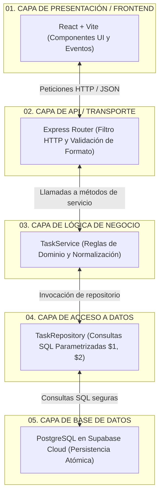

# Universidad Privada Domingo Savio (UPDS)
## Facultad de Ingeniería — Carrera de Ingeniería de Sistemas / Redes
### Programación Web II — Gestión 2026

---

# 🏗️ Laboratorio 1: Arquitectura Primero (Mini Task Manager)
> *"La arquitectura permanece. La tecnología puede cambiar."*

Bienvenido al repositorio oficial del **Laboratorio 1**. En esta etapa formativa nos enfocamos en el **diseño arquitectónico, la separación estricta en 5 capas, la sostenibilidad digital y el ciclo de vida colaborativo asistido por IA (AI-DLC)** antes de escribir código de aplicación.

---

## 👤 Ficha Técnica del Estudiante

* **Estudiante:** Charles
* **Materia:** Programación Web II
* **Semestre / Gestión:** 2026
* **Microproyecto:** Mini Task Manager (Andamio Arquitectónico para el MVP)
* **Stack Oficial:** React 18 + Vite · Node.js + Express · PostgreSQL (Supabase)
* **Repositorio GitHub Oficial:** [https://github.com/Charles2810/lab1ProgWeb2](https://github.com/Charles2810/lab1ProgWeb2)

---

## 🏛️ Diagrama de las 5 Responsabilidades (Mermaid)



---

## 🗺️ Mapa de Documentación del Repositorio

El proyecto cumple estrictamente la estructura modular exigida por la guía docente del laboratorio:

```text
lab1/
├── README.md                           # Documento principal de bienvenida y estado
├── .gitignore                          # Exclusión de archivos sensibles (.env, node_modules)
├── docs/
│   ├── alcance.md                      # [Paso 5] Problema central, usuario objetivo y 4 acciones MVP (YAGNI)
│   ├── arquitectura/
│   │   ├── 01-cinco-capas.md           # [Pasos 1-2] Teoría de las 5 capas, matriz y 5 desafíos resueltos
│   │   ├── 02-flujo-tarea.md           # [Paso 4] Los 13 pasos de 'Crear una tarea' y diagrama de secuencia
│   │   └── 03-mvp.md                   # [Paso 6] Arquitectura del MVP, entidad Task, reglas de negocio y seguridad
│   ├── sostenibilidad/
│   │   └── presupuesto.md              # [Paso 7] Presupuesto de peso/requests, dependencias y 7 preguntas clave
│   ├── ia/
│   │   └── registro-ia.md              # [Paso 10] Bitácora AI-DLC, 2 decisiones críticas y 'Qué rechazamos'
│   ├── reflexiones/
│   │   └── lab-01-Charles.md           # [Entregable Indiv.] Reflexión metacognitiva (5 líneas c/u) y justificación
│   └── referencia-completa.md          # Archivo de respaldo del borrador de sesiones del proyecto global
├── api/
│   └── .gitkeep                        # Directorio reservado para la implementación del backend (Lab 2)
├── frontend/
│   └── .gitkeep                        # Directorio reservado para el cliente React
└── reports/
    └── README.md                       # Carpeta de evidencias (lab-01-repo.png)
```

---

## 📑 Enlaces Directos a los Documentos Clave

1. 🎯 [Definición del Alcance (docs/alcance.md)](docs/alcance.md)
2. 🏛️ [Fundamentos de las 5 Capas (docs/arquitectura/01-cinco-capas.md)](docs/arquitectura/01-cinco-capas.md)
3. 🔄 [Flujo 'Crear una Tarea' en 13 Pasos (docs/arquitectura/02-flujo-tarea.md)](docs/arquitectura/02-flujo-tarea.md)
4. ⚙️ [Arquitectura del MVP y Entidad Task (docs/arquitectura/03-mvp.md)](docs/arquitectura/03-mvp.md)
5. 🍃 [Presupuesto de Sostenibilidad (docs/sostenibilidad/presupuesto.md)](docs/sostenibilidad/presupuesto.md)
6. 🤖 [Bitácora de IA - AI DLC (docs/ia/registro-ia.md)](docs/ia/registro-ia.md)
7. 🧠 [Reflexión Metacognitiva Individual (docs/reflexiones/lab-01-Charles.md)](docs/reflexiones/lab-01-Charles.md)
8. 📦 [Respaldo de Referencia Global (docs/referencia-completa.md)](docs/referencia-completa.md)

---

## 📋 Matriz de Tecnologías

| Capa / Responsabilidad | Tecnología Seleccionada | Justificación y Rol |
|---|---|---|
| **01. Frontend** | React 18 + Vite | SPA reactiva y ligera; renderizado rápido y consumo de API. |
| **02. API** | Node.js + Express | Servidor HTTP mínimo; actúa como filtro y traductor de datos. |
| **03. Lógica de Negocio** | Servicios JavaScript (`taskService.js`) | Aislamiento de reglas operacionales e invariantes del dominio. |
| **04. Acceso a Datos** | Patrón Repository con cliente SQL | Queries parametrizadas (`$1, $2`) previniendo SQL Injection. |
| **05. Base de Datos** | PostgreSQL (Supabase Cloud) | Motor relacional robusto con garantías ACID y soporte RLS. |

---

## ✅ Checkpoints de Validación (Consolidado)

- [x] **Responsabilidades:** Dominio y definición clara de las 5 responsabilidades sin apuntes.
- [x] **Matriz de Comunicación:** Tabla exhaustiva de *"qué hace / qué NO hace / con quién habla"* completa en `01-cinco-capas.md`.
- [x] **Diagramas Mermaid:** Diagramas funcionales renderizables en GitHub (`flowchart` y `sequenceDiagram`).
- [x] **Flujo de Tareas:** Desglose del caso *"Crear una tarea"* documentado en 13 pasos secuenciales en `02-flujo-tarea.md`.
- [x] **Repositorio y Estructura:** Carpetas organizadas y `.gitignore` activo (excluyendo `.env` y credenciales).
- [x] **Registro de Decisiones (AI-DLC):** `docs/ia/registro-ia.md` con 2 decisiones críticas y sección obligatoria *"Qué rechazamos"*.
- [x] **Reflexión Individual:** `docs/reflexiones/lab-01-Charles.md` completada con métricas requeridas.
- [ ] **Captura y Git Log:** Subir captura `reports/lab-01-repo.png` tras ejecutar el commit obligatorio.

---

## 🚀 Próximo Laboratorio: LAB 2 (Día 3)
* **Tema:** *"Del problema al MVP y al CONTRATO DE LA API"*.
* **Objetivos:** Creación del Backlog priorizado y diseño formal de los endpoints clave de la API (`GET`, `POST`, `PATCH`, `DELETE /tasks`) antes de escribir código.
