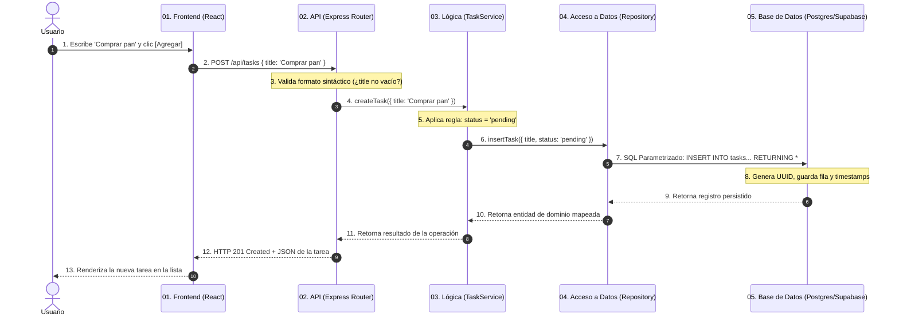

# Flujo Detallado: "Crear una Tarea" a través de las 5 Capas

**Documento:** `docs/arquitectura/02-flujo-tarea.md`  
**Laboratorio:** 01 — Arquitectura Primero  
**Materia:** Programación Web II (UPDS)  
**Estudiante:** Charles  

---

## 1. Descripción del Flujo Operativo

Para comprender la colaboración entre capas, se analiza el ciclo de vida completo de la acción **"Crear una Tarea"** (por ejemplo, el usuario desea registrar *"Comprar pan"*). El proceso se desglosa en **13 pasos secuenciales** que garantizan que ninguna capa asuma responsabilidades ajenas.

---

## 2. Los 13 Pasos del Flujo

### Fase 1: Interacción y Captura (Pasos 1 y 2)
* **Paso 1 (Usuario):** El usuario escribe `"Comprar pan"` en la caja de texto y presiona el botón **[Agregar Tarea]**.
* **Paso 2 (Frontend):** El cliente React captura el evento, empaqueta el contenido en un payload JSON `{ "title": "Comprar pan" }` y despacha una petición asíncrona mediante `fetch('POST', '/api/tasks', ...)`.

### Fase 2: Filtrado y Reglas de Negocio (Pasos 3 a 5)
* **Paso 3 (API - Filtro de Entrada):** El controlador de Express recibe la petición HTTP. Valida exclusivamente el **formato sintáctico**: ¿existe la propiedad `title`? ¿es de tipo string? ¿tiene longitud > 0 tras remover espacios? Si no cumple, responde de inmediato con código `400 Bad Request` y detiene el flujo.
* **Paso 4 (API a Lógica de Negocio):** Al ser sintácticamente válido, el controlador delega la operación invocando al servicio: `taskService.createTask({ title: req.body.title })`.
* **Paso 5 (Lógica de Negocio):** El servicio aplica las reglas de negocio del dominio:
  1. Limpia y normaliza el texto (trim de espacios en blanco).
  2. Asigna obligatoriamente el estado operativo inicial: `status: 'pending'`.
  3. Prepara la estructura de la entidad para el repositorio.

### Fase 3: Persistencia y Almacenamiento Seguro (Pasos 6 a 8)
* **Paso 6 (Lógica de Negocio a Repository):** El servicio solicita la persistencia al módulo de acceso a datos: `taskRepository.insert({ title, status })`.
* **Paso 7 (Repository - Acceso a Datos):** El repositorio construye una **consulta parametrizada** para evitar inyecciones SQL:
  ```sql
  INSERT INTO tasks (title, status) VALUES ($1, $2) RETURNING id, title, status, created_at, updated_at;
  ```
  Envía la instrucción al cliente de PostgreSQL / Supabase.
* **Paso 8 (Base de Datos):** El motor PostgreSQL ejecuta la inserción de manera atómica, autogenera el identificador único `UUID`, marca la fecha actual `now()` y devuelve el registro confirmado.

### Fase 4: Retorno y Propagación Ascendente (Pasos 9 a 11)
* **Paso 9 (Base de Datos a Repository):** La base de datos responde con la fila insertada. El repositorio la transforma a una entidad limpia de dominio y la retorna a la Lógica de Negocio.
* **Paso 10 (Lógica de Negocio a API):** El servicio verifica que el resultado sea válido y lo transfiere al controlador de la API.
* **Paso 11 (API - Respuesta HTTP):** El controlador serializa el objeto en formato JSON y emite una respuesta formal con código de estado exitoso **`201 Created`**:
  ```json
  {
    "id": "550e8400-e29b-41d4-a716-446655440000",
    "title": "Comprar pan",
    "status": "pending",
    "created_at": "2026-09-14T17:30:00Z",
    "updated_at": "2026-09-14T17:30:00Z"
  }
  ```

### Fase 5: Renderizado y Cierre Visual (Pasos 12 y 13)
* **Paso 12 (Frontend):** El cliente React recibe la respuesta `201`, actualiza su estado interno local (añadiendo el nuevo objeto a la lista en memoria mediante `setTasks(prev => [...prev, newTask])`) y limpia el input del formulario.
* **Paso 13 (Usuario):** La interfaz visual reacciona de inmediato mostrando el nuevo elemento *"Comprar pan"* con el badge `"Pendiente"`, confirmando visualmente la finalización de la operación.

---

## 3. Diagrama de Secuencia (Mermaid)



---

## 4. Auditoría de Fronteras en el Flujo

* **¿El Frontend sabe de SQL?** No. Solo envía JSON y recibe JSON.
* **¿La API sabe si la base de datos es Postgres o MongoDB?** No. Solo se comunica con el servicio mediante métodos JavaScript.
* **¿La Lógica de Negocio sabe si la petición vino por HTTP o por consola?** No. Recibe argumentos y devuelve resultados o lanza excepciones de dominio.
* **¿La Base de Datos sabe qué botón presionó el usuario?** No. Solo recibe sentencias SQL parametrizadas a través del connection pool.
