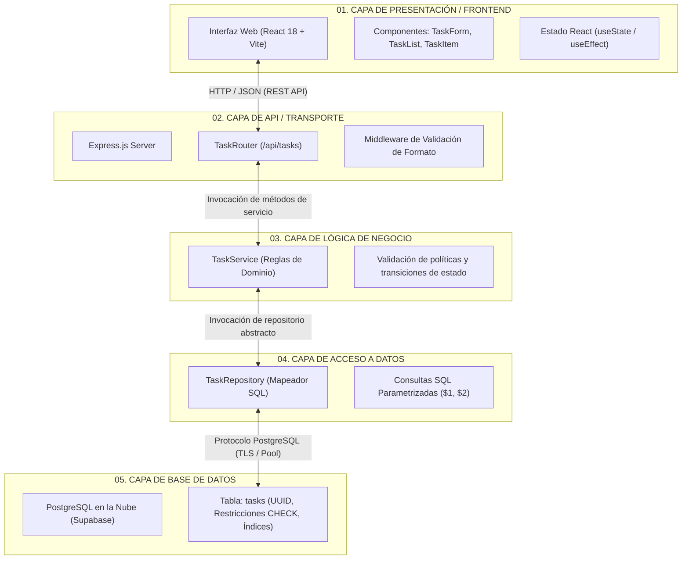

# Arquitectura del MVP — Mini Task Manager

**Documento:** `docs/arquitectura/03-mvp.md`  
**Laboratorio:** 01 — Arquitectura Primero  
**Materia:** Programación Web II (UPDS)  
**Estudiante:** Charles  

---

## 1. Diagrama de Arquitectura de 5 Capas (Mermaid)

El siguiente diagrama modela la separación estricta de responsabilidades del **Mini Task Manager**:



---

## 2. Entidad del Dominio: `Task`

La entidad central del MVP modela los atributos esenciales para la gestión del ciclo de vida de una tarea:

| Atributo | Tipo de Dato | Restricciones | Propósito |
|---|---|---|---|
| `id` | `UUID` | Primary Key, `gen_random_uuid()` | Identificador universal único de la tarea. |
| `title` | `VARCHAR(200)` | `NOT NULL`, trim length >= 3 | Descripción textual del objetivo de la tarea. |
| `status` | `VARCHAR(20)` | `NOT NULL`, DEFAULT `'pending'` | Estado actual de la tarea (`'pending'` o `'done'`). |
| `created_at` | `TIMESTAMPTZ` | `NOT NULL`, DEFAULT `now()` | Marca temporal de creación para auditoría y ordenamiento. |
| `updated_at` | `TIMESTAMPTZ` | `NOT NULL`, DEFAULT `now()` | Marca temporal de la última modificación. |

### Definición SQL DDL Preliminar
```sql
CREATE TABLE tasks (
    id UUID PRIMARY KEY DEFAULT gen_random_uuid(),
    title VARCHAR(200) NOT NULL,
    status VARCHAR(20) NOT NULL DEFAULT 'pending' CHECK (status IN ('pending', 'done')),
    created_at TIMESTAMPTZ NOT NULL DEFAULT NOW(),
    updated_at TIMESTAMPTZ NOT NULL DEFAULT NOW()
);
```

---

## 3. Reglas de Negocio de Alta Prioridad

Siguiendo la plantilla formal: *"Cuando pasa X, no se permite Y sin Z"*:

1. **Regla de Creación:**  
   > *Cuando se solicita crear una tarea, no se permite el almacenamiento en base de datos si el título tiene menos de 3 caracteres significativos (sin contar espacios), y su estado inicial siempre debe ser fijado obligatoriamente en `'pending'` por el sistema.*
2. **Regla de Transición de Estados:**  
   > *Cuando se solicita cambiar el estado de una tarea, no se permite la transición si el nuevo estado difiere estrictamente de los valores permitidos (`'pending'` ↔ `'done'`).*
3. **Regla de Idempotencia y Existencia:**  
   > *Cuando se intenta modificar o eliminar una tarea mediante su identificador único (`id`), no se permite continuar la operación sin antes verificar la existencia previa del registro, debiendo retornar una notificación semántica clara (`404 Not Found`) en caso de no existir.*

---

## 4. Decisiones de Arquitectura: Accesibilidad (a11y)

De acuerdo con el lineamiento socioformativo del laboratorio, la accesibilidad se diseña desde la arquitectura antes de escribir código:

* **Responsabilidad del Frontend:**
  * Uso estricto de HTML semántico (`<main>`, `<section>`, `<form>`, `<label>`, `<button>`).
  * Enfoque accesible y contraste cromático adecuado según pautas WCAG 2.1 AA.
  * Asociación explícita de mensajes de error con el atributo `aria-describedby` y `aria-invalid="true"`.
* **Responsabilidad de la API (Backend):**
  * La API rechaza errores crípticos como `{ error: 'ERR_4021' }`.
  * La API devuelve contratos legibles para tecnologías de asistencia (lectores de pantalla):
    ```json
    {
      "status": 400,
      "error": "El título de la tarea no puede estar vacío.",
      "field": "title"
    }
    ```

---

## 5. Decisiones de Arquitectura: Seguridad

* **Mitigación de Inyección SQL (OWASP A03:2021):**  
  Queda prohibida terminantemente la concatenación o interpolación de variables dentro de strings SQL (`'${title}'`). Todas las operaciones en la capa de Acceso a Datos deben usar consultas parametrizadas con marcadores de posición (`$1, $2`).
* **Gestión de Credenciales y Secretos:**  
  Las cadenas de conexión a PostgreSQL y las API Keys de Supabase jamás se incluirán en el código fuente ni se subirán al repositorio de Git. Se consumirán exclusivamente a través de variables de entorno administradas en un archivo local `.env` (protegido por `.gitignore`).
